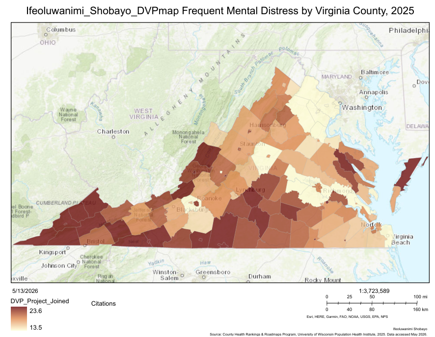
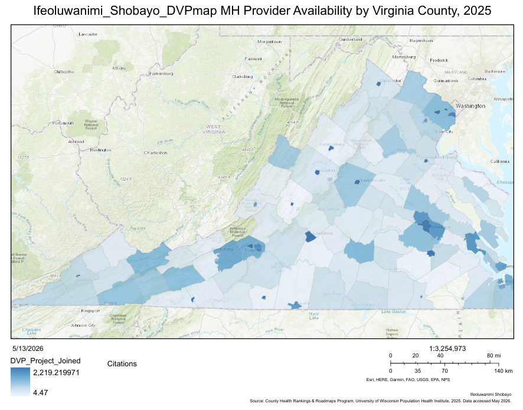
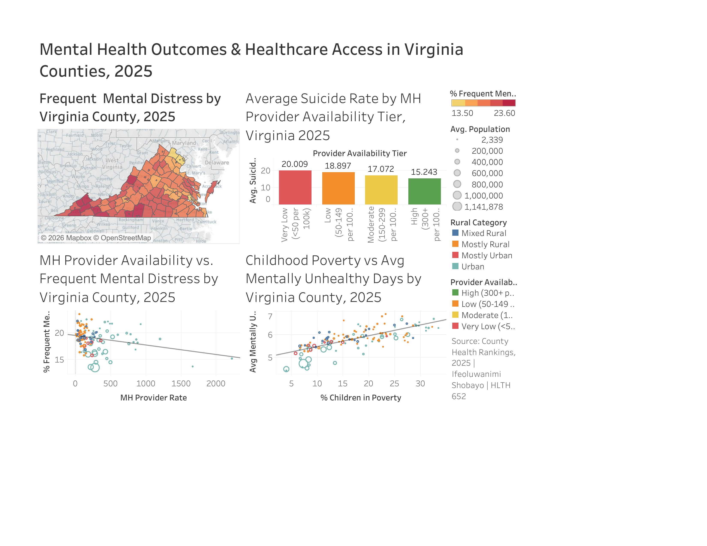

# Mental Health Outcomes & Healthcare Access in Virginia Counties, 2025

This project examines geographic disparities in mental health outcomes across Virginia's 133 counties using 2025 County Health Rankings data. Spatial mapping in ArcGIS Pro and statistical visualization in Tableau were used to explore how mental health provider availability, childhood poverty, and rurality relate to mental health burden across the state.

## Research Questions

1. Do counties with higher frequent mental distress rates tend to have fewer mental health providers?
2. How does provider availability relate to county-level suicide rates?
3. Does childhood poverty correlate with more mentally unhealthy days?

## Key Findings

Counties in southwestern and southside Virginia reported frequent mental distress rates above 22%, while northern Virginia urban counties fell below 16%, reflecting a clear rural-urban divide. A statistically significant negative correlation was found between mental health provider availability and frequent mental distress (R² = 0.08, p = 0.002). Counties with fewer than 50 providers per 100,000 residents averaged a suicide rate of 20.01, compared to 15.24 in high-availability counties, a 31% difference. Childhood poverty was the strongest predictor, explaining 51% of the variation in average mentally unhealthy days across all 133 counties (R² = 0.51, p < 0.0001).

## Visualizations

### Frequent Mental Distress by Virginia County, 2025

Counties shaded by percentage of residents reporting frequent mental distress, ranging from 13.5% to 23.6%. Southwestern counties carry the highest burden.

[View interactive ArcGIS map](https://arcg.is/1vf9T00)

### MH Provider Availability by Virginia County, 2025

Counties shaded by licensed mental health providers per 100,000 residents, ranging from 4.47 to 2,219.22. Lighter shading indicates fewer providers, concentrated in the same southwestern counties with the highest distress rates.

[View interactive ArcGIS map](https://arcg.is/rPn000)

### Tableau Dashboard

A composite view of mental distress distribution, provider availability tiers, suicide rates, and childhood poverty across Virginia's 133 counties.

## Tools and Methods

ArcGIS Pro was used for choropleth mapping of county-level mental distress and provider availability. Tableau was used for statistical visualization including scatter plots, bar charts, and the final interactive dashboard. Data came from the 2025 County Health Rankings, covering all 133 Virginia counties.

## Data Source

County Health Rankings & Roadmaps Program. 2025 County Health Rankings Virginia Data. University of Wisconsin Population Health Institute. Accessed May 2026. https://www.countyhealthrankings.org

## Author

Ifeoluwanimi Shobayo
